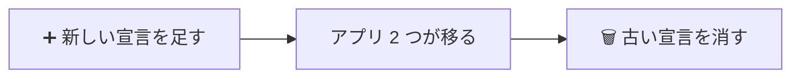

# kmp-app-template

## 🛠️ 作業の進め方

- 変更したら `make verify` を通す。
- バージョンは `gradle/libs.versions.toml` 以外で指定しない。
- Kotlin・kotlinx・Ktor は、アプリ側が使っているバージョンより新しくしない。アプリに持ち込まれ、そこでの下限になる。Renovate は承認してから PR を作る。
- `.gitignore` に `*.jar` を追加しない（`gradle-wrapper.jar` が消える）。

> [!CAUTION]
> main の `Package.swift` の URL とチェックサムは直さない。リリースのコミットはタグにだけあり、main には戻さない。

## ✍️ コードの書き方

> [!IMPORTANT]
> **コメントを書かない。** コード、設定、スクリプト、CI のいずれにも書かない。要ると判断したら、書かずに提案する。Renovate が Actions の SHA の横に付けるバージョンのコメントは除く。

**iOS に公開する関数**の失敗の扱い

| 失敗 | 扱い |
| --- | --- |
| 通信などで起こる失敗 | 例外にせず sealed な型で返す |
| 呼び出し順の誤り（`Session.configure` の前に使うなど） | プログラムの誤りなので、例外で落としてよい |

- iOS に出すフレームワークは `Shared` 1 つだけにする。モジュールを分けたら `Shared` から export する（別のフレームワークにすると Kotlin のランタイムが 2 つ入り、型も共有できない）。

## 🔗 3 リポジトリの取り決め

公開 API は足すだけにする。変えたいときは新しい宣言を足し、古いものは残す。

- 消すのは、アプリ側 2 リポジトリが使わなくなってから。CI の「アプリのコンパイル」が通ることで確かめる。
- アプリ側のバージョン上げの PR は、Release ワークフローが開く。手で開くときも、リリースが終わってから開く（publish されていないバージョンを指定すると解決できずに落ちる）。

> [!WARNING]
> `@Deprecated` は付けない。iOS は警告をエラーにしているので、付けたバージョンに上げた時点でビルドが落ちる。
