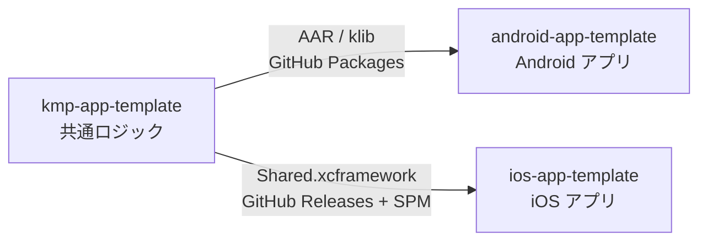

# kmp-app-template

iOS と Android で共有するロジックを Kotlin Multiplatform で書いたライブラリです。PokeAPI からのポケモン一覧の取得、ページング、エラーの分類までを担い、画面は持ちません。

## 3 つのリポジトリ

- [android-app-template](https://github.com/yossibank/android-app-template) — Jetpack Compose のアプリ
- [ios-app-template](https://github.com/yossibank/ios-app-template) — SwiftUI のアプリ

## 技術スタック

| | |
| --- | --- |
| 通信 / シリアライズ | Ktor / kotlinx.serialization |
| 並行性 | Kotlin Coroutines |
| Swift 連携 | SKIE |
| モデル生成 | openapi-generator |
| テスト | kotlin.test（`commonTest` に書き、JVM と iOS シミュレータで実行） |

## 使い方

変更したら `make verify` を通します。

リリースは GitHub Actions の **Release** ワークフローにバージョン（semver）を渡して実行します（手元では `./release.sh <version>`）。XCFramework のビルド、GitHub Packages への publish、`Package.swift` の更新、タグ付けまでを行います。リリース後に、アプリ側 2 リポジトリのバージョン指定を上げます。
