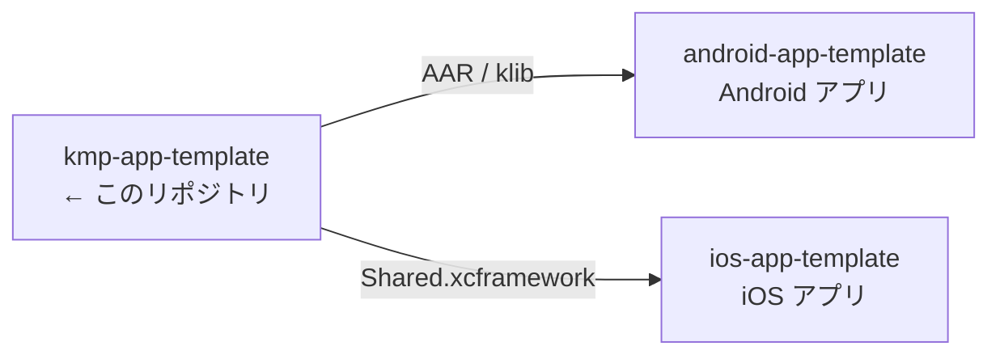
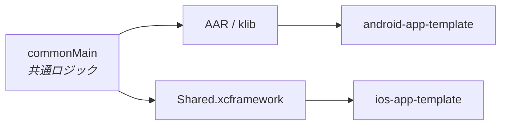

# kmp-app-template

> iOS / Android で共有するロジックの Kotlin Multiplatform ライブラリ。アプリ本体は含まない。

書き方の規約は [CLAUDE.md](CLAUDE.md)。

## 3 リポジトリの関係



[ios-app-template](https://github.com/yossibank/ios-app-template) ・
[android-app-template](https://github.com/yossibank/android-app-template)

## モジュール構成



単一モジュール（`:shared`）。iOS へは XCFramework 1 枚として公開される。

## ディレクトリ

```
shared/
├── build.gradle.kts        # ターゲット・配布・SKIE・モデル生成の設定
├── openapi/                # モデル生成の元にする定義
└── src/
    ├── commonMain/kotlin/  # 共通ロジック
    ├── commonTest/kotlin/  # 両OSで実行されるテスト
    ├── androidMain/kotlin/ # Android 固有の実装（現在は空）
    └── iosMain/kotlin/     # iOS 固有の実装（現在は空）
gradle/
└── libs.versions.toml      # 依存とバージョン（ここにのみ書く）
Package.swift               # iOS から SPM で参照するための宣言
```

## コマンド

| コマンド | 内容 |
| --- | --- |
| `make verify` | XCFramework のビルド + 全ターゲットのテスト（変更後はこれを通す） |
| `make build-android` | AAR / klib |
| `make build-ios` | `Shared.xcframework` → `shared/build/XCFrameworks/{debug,release}/` |
| `make test` | 全ターゲットのテスト |
| `make lint` | ktlint によるチェック（`make verify` に含まれる） |
| `make format` | ktlint で自動修正 |
| `make publish-local` | mavenLocal へ publish（アプリ側から参照するため） |
| `make publish-github` | GitHub Packages へ publish（`gpr.user` / `gpr.token` が必要） |

## 環境

| 項目 | バージョン |
| --- | --- |
| Gradle | 9.7.1 |
| Kotlin | 2.4.10 |
| Android Gradle Plugin | 9.4.0 |
| compileSdk | 37 |
| minSdk | 24 |
| iOS ターゲット | iosArm64 / iosSimulatorArm64 |
| Xcode | 26.x（iOS ターゲットのビルドに必要） |
