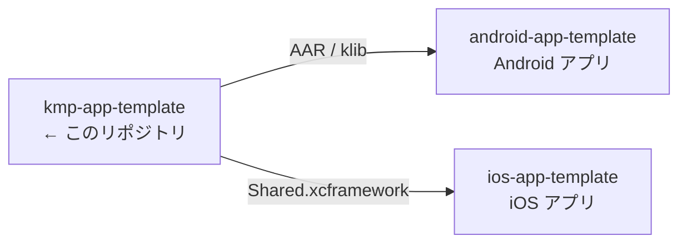

# kmp-app-template

> iOS / Android で共有するロジックの Kotlin Multiplatform ライブラリ。アプリ本体は含まない。

## 3 リポジトリの関係



[ios-app-template](https://github.com/yossibank/ios-app-template) ・
[android-app-template](https://github.com/yossibank/android-app-template)

## コマンド

| コマンド | 内容 |
| --- | --- |
| `make verify` | XCFramework のビルド + 全ターゲットのテスト（変更後はこれを通す） |
| `make build-android` | AAR / klib |
| `make build-ios` | `Shared.xcframework` → `shared/build/XCFrameworks/{debug,release}/` |
| `make publish-local` | mavenLocal へ publish（アプリ側から参照するため） |
| `make test` | 全ターゲットのテスト |

## モジュール構成

```
shared/src/
├─ commonMain/   共通ロジック
├─ commonTest/   両OSで実行されるテスト
├─ androidMain/  Android 固有の実装
└─ iosMain/      iOS 固有の実装
```

## 環境

| 項目 | バージョン |
| --- | --- |
| Gradle | 9.7.1 |
| Kotlin | 2.4.10 |
| Android Gradle Plugin | 9.3.2 |
| compileSdk | 37 |
| minSdk | 24 |
| iOS ターゲット | iosArm64 / iosSimulatorArm64 / iosX64 |
| Xcode | 26.x（iOS ターゲットのビルドに必要） |
