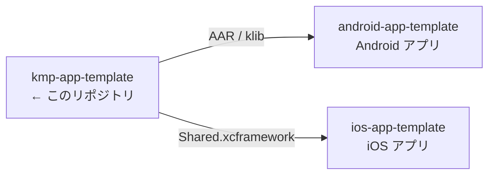
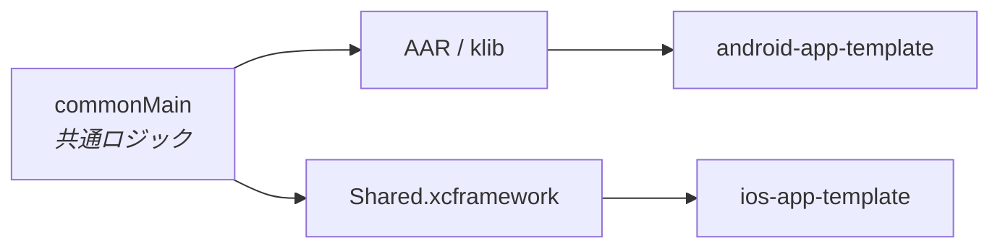

# kmp-app-template

> iOS / Android で共有するロジックの Kotlin Multiplatform ライブラリ。アプリ本体は含まない。

書き方の規約は [CLAUDE.md](CLAUDE.md)。

## 3 リポジトリの関係



[ios-app-template](https://github.com/yossibank/ios-app-template) ・
[android-app-template](https://github.com/yossibank/android-app-template)

## モジュール構成



単一モジュール（`:shared`）。iOS へは XCFramework 1 枚として公開される。

## ディレクトリ

```
shared/
├── build.gradle.kts        # ターゲット・配布・SKIE・モデル生成の設定
├── api/                    # 公開 API のダンプ（差分が出たら消費側が壊れる）
├── openapi/                # モデル生成の元にする定義
└── src/
    ├── commonMain/kotlin/  # 共通ロジック
    ├── commonTest/kotlin/  # 両OSで実行されるテスト
    ├── androidMain/kotlin/ # Android 固有の実装（現在は空）
    └── iosMain/kotlin/     # iOS 固有の実装（現在は空）
gradle/
└── libs.versions.toml      # 依存とバージョン（ここにのみ書く）
Package.swift               # iOS から SPM で参照するための宣言
```

## コマンド

| コマンド | 内容 |
| --- | --- |
| `make verify` | XCFramework のビルド + 全ターゲットのテスト（変更後はこれを通す） |
| `make build-android` | AAR / klib |
| `make build-ios` | `Shared.xcframework` → `shared/build/XCFrameworks/{debug,release}/` |
| `make test` | 全ターゲットのテスト |
| `make lint` | ktlint によるチェック（`make verify` に含まれる） |
| `make format` | ktlint で自動修正 |
| `make api` | 公開 API のダンプ（`shared/api/`）を更新する。`make verify` は差分があると落ちる |
| `make publish-local` | mavenLocal へ publish（アプリ側から参照するため） |
| `make publish-github` | GitHub Packages へ publish（`gpr.user` / `gpr.token` が必要） |

## リリース

GitHub Actions の **Release** ワークフローを実行し、バージョンを semver で渡す。
XCFramework のビルド、GitHub Packages への publish、リリース作成、`Package.swift` の url と
checksum の更新、コミットとタグまでを 1 回で行う。手元の Xcode 設定に左右されない。

同じ手順を手元で実行する `release.sh` も残してある。引数は同じ。

リリース後に消費側 2 リポジトリのバージョン指定を更新し、その PR を開く。publish される前に
PR を開くと、pin を解決できずに落ちる。

## 環境

| 項目 | 出所 |
| --- | --- |
| Kotlin・AGP・SKIE・Ktor・依存 | [gradle/libs.versions.toml](gradle/libs.versions.toml) |
| Gradle | [gradle/wrapper/gradle-wrapper.properties](gradle/wrapper/gradle-wrapper.properties) |
| compileSdk / minSdk・JVM ターゲット・iOS ターゲット | [shared/build.gradle.kts](shared/build.gradle.kts) |
| JDK（CI） | [.github/workflows/verify.yml](.github/workflows/verify.yml) |
| Xcode | リポジトリでは固定していない。CI は [verify.yml](.github/workflows/verify.yml) のランナー任せ |
