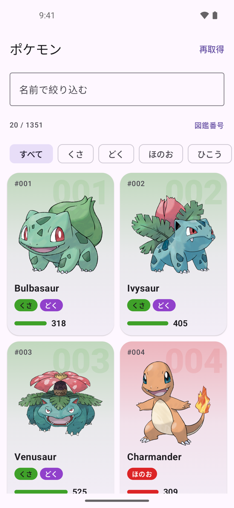
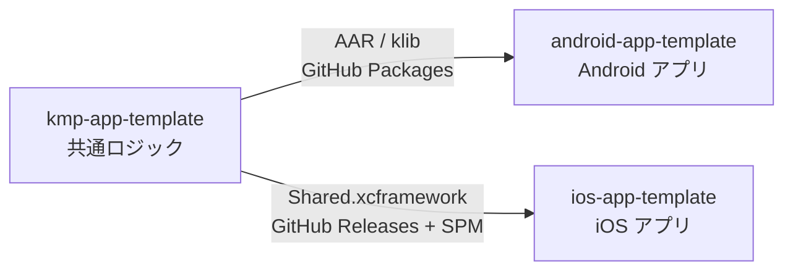

# kmp-app-template

iOS と Android で共有するロジックを Kotlin Multiplatform で書いたライブラリ

PokeAPI からの一覧取得・ページング・エラーの分類を担います。

<table>
  <tr>
    <th>iOS（SwiftUI）</th>
    <th>Android（Jetpack Compose）</th>
  </tr>
  <tr>
    <td>
      <picture>
        <source media="(prefers-color-scheme: dark)" srcset="docs/images/ios-list-dark.png">
        
      </picture>
    </td>
    <td>
      <picture>
        <source media="(prefers-color-scheme: dark)" srcset="docs/images/android-list-dark.png">
        
      </picture>
    </td>
  </tr>
</table>

## 3 つのリポジトリ

[android-app-template](https://github.com/yossibank/android-app-template) ・ [ios-app-template](https://github.com/yossibank/ios-app-template)

## 使い方

変更したら `make verify` を通します。

> [!NOTE]
> 公開 API は `shared/api/` にダンプしてあり、差分があると `make verify` が落ちます。API を変えたら `make api` で更新します。

リリース

GitHub Actions の **Release** ワークフローにバージョン（semver）を渡して実行します（手元では `./release.sh <version>`）。

1. XCFramework をビルドする
2. `Package.swift` を更新してタグを付ける
3. GitHub Packages へ publish する

リリース後に、アプリ側 2 リポジトリのバージョン指定を上げます。

