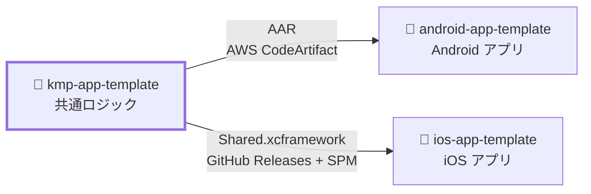
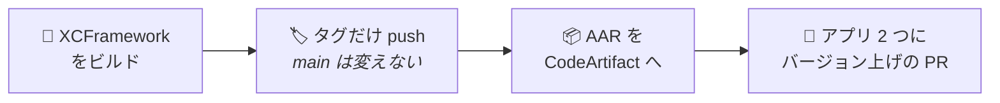

<div align="center">

# 🧩 kmp-app-template

iOS と Android で共有するロジックを Kotlin Multiplatform で書いたライブラリ

[](https://github.com/yossibank/kmp-app-template/actions/workflows/verify.yml)
[](https://github.com/yossibank/kmp-app-template/releases/latest)
[](LICENSE)


<table>
  <tr>
    <th>🍎 iOS（SwiftUI）</th>
    <th>🤖 Android（Jetpack Compose）</th>
  </tr>
  <tr>
    <td>
      <picture>
        <source media="(prefers-color-scheme: dark)" srcset="docs/images/ios-list-dark.png">
        
      </picture>
    </td>
    <td>
      <picture>
        <source media="(prefers-color-scheme: dark)" srcset="docs/images/android-list-dark.png">
        
      </picture>
    </td>
  </tr>
</table>

</div>

## 📦 共通コアが担うこと

| | 内容 |
| --- | --- |
| 🔐 ログイン | DummyJSON へのログインと、トークンの保存（Keychain / Keystore）・更新 |
| 🛍️ 商品一覧 | 価格・ブランドを含む取得とページング |
| ⚠️ エラー | 通信の失敗を分類して返す |

## 🔗 3 つのリポジトリ


```mermaid
flowchart LR
    KMP["🧩 kmp-app-template<br/>共通ロジック"]
    AND["🤖 android-app-template<br/>Android アプリ"]
    IOS["🍎 ios-app-template<br/>iOS アプリ"]
    KMP -->|"AAR<br/>AWS CodeArtifact"| AND
    KMP -->|"Shared.xcframework<br/>GitHub Releases + SPM"| IOS
    style KMP stroke-width:3px
```

[🍎 ios-app-template](https://github.com/yossibank/ios-app-template) ・ [🤖 android-app-template](https://github.com/yossibank/android-app-template)

## 🚀 使い方

| コマンド | いつ使うか |
| --- | --- |
| `make verify` | 変更したら通す |
| `make api` | 公開 API を変えたら、`shared/api/` のダンプを更新する |

> [!IMPORTANT]
> 公開 API のダンプと差分があると `make verify` が落ちます。

> [!TIP]
> 既存のアプリに組み込む手順は [docs/integration.md](docs/integration.md) にあります。

## 🏷️ リリース

GitHub Actions の **Release** ワークフローにバージョン（semver）を渡して実行します。


```mermaid
flowchart LR
    BUILD["🔨 XCFramework<br/>をビルド"]
    TAG["🏷️ タグだけ push<br/><i>main は変えない</i>"]
    AAR["📦 AAR を<br/>CodeArtifact へ"]
    PR["🔀 アプリ 2 つに<br/>バージョン上げの PR"]
    BUILD --> TAG --> AAR --> PR
```

> [!NOTE]
> 手元からは、AWS にログインしたうえで `./release.sh <version>` を実行します。

<details>
<summary>🧰 テンプレートから作ったとき</summary>

パッケージの接頭辞と GitHub のオーナーを置き換えます。3 つのリポジトリそれぞれで実行します。

```sh
scripts/rename.sh <GitHub のオーナー> <パッケージの接頭辞>    # 例: scripts/rename.sh acme com.acme
```

</details>
