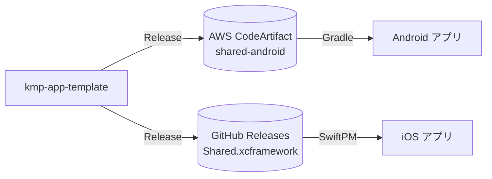
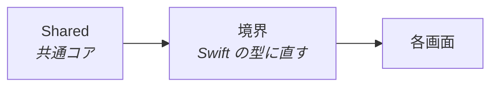

# 既存アプリに組み込む

共通コアを、すでにある iOS / Android アプリに足す手順です。



## アプリ側に求めるもの

| 項目 | 決まる場所 | 影響 |
| --- | --- | --- |
| Kotlin・kotlinx・Ktor | `gradle/libs.versions.toml` | アプリに持ち込まれ、そこでの下限になる |
| OkHttp | Ktor の OkHttp エンジン | Ktor が要求するバージョンまで引き上げられる |
| minSdk | `shared/build.gradle.kts` | これより低いアプリには入らない |
| 最低 iOS | Kotlin/Native の既定 | XCFramework の `MinimumOSVersion` より低いアプリには入らない |
| Xcode | `Package.swift` の `swift-tools-version` | これより古い Xcode では解決できない |

## Android

### 1. 取得先と依存を足す

`gradle.properties`

```properties
codeArtifact.domain=<ドメイン>
codeArtifact.owner=<AWS アカウント ID>
codeArtifact.region=<リージョン>
codeArtifact.repository=<リポジトリ>
```

`settings.gradle.kts`

```kotlin
fun codeArtifact(name: String) = providers.gradleProperty("codeArtifact.$name").get()

dependencyResolutionManagement {
    repositories {
        maven {
            name = "CodeArtifact"
            url = uri(
                "https://${codeArtifact("domain")}-${codeArtifact("owner")}.d.codeartifact." +
                    "${codeArtifact("region")}.amazonaws.com/maven/${codeArtifact("repository")}/",
            )
            content {
                includeGroup("com.yossibank")
            }
            credentials {
                username = "aws"
                password = providers.gradleProperty("codeArtifactPassword").orNull
            }
        }
        google()
        mavenCentral()
    }
}
```

依存は `com.yossibank:shared-android:<バージョン>` です。

### 2. トークンを渡す

| 場所 | 渡し方 | 見本 |
| --- | --- | --- |
| 手元 | `~/.gradle/gradle.properties` の `codeArtifactPassword`（12 時間有効） | android-app-template の `make token` |
| CI | OIDC で `<リポジトリ名>-read` ロールを引き受け、`ORG_GRADLE_PROJECT_codeArtifactPassword` に入れる | android-app-template の `verify.yml` |

### 3. 起動時に設定する

KMP の型は Kotlin の型なので、境界のモジュールは作らずにそのまま使います。

```kotlin
class App : Application() {
    override fun onCreate() {
        super.onCreate()
        Session.configure(this, "https://api.example.com")
    }
}
```

## iOS

### 1. パッケージを足す

```swift
.package(url: "https://github.com/<オーナー>/kmp-app-template.git", exact: "<バージョン>")
```

ターゲットの依存は `.product(name: "Shared", package: "kmp-app-template")` です。

### 2. 資格情報を渡す（プライベートのとき）

XCFramework は `api.github.com` から取るので、リポジトリを clone できるだけでは足りません。

| 場所 | 渡し方 | 見本 |
| --- | --- | --- |
| 手元 | `~/.netrc` に `api.github.com` の資格情報（Contents の読み取りだけの PAT） | 下のとおり |
| CI | GitHub App のトークンを `~/.netrc` と `git insteadOf` に入れる | ios-app-template の `verify.yml` |

```netrc
machine api.github.com
  login x-access-token
  password <PAT>
```

### 3. 境界のモジュールを 1 つ作る



KMP の型（`Int32` や sealed interface）を画面に出しません。共通コアの API が増えても、直すのはこのモジュールだけです。見本は ios-app-template の `SharedCore` です。

### 4. 起動時に設定する

```swift
Session.shared.configure(baseUrl: "https://api.example.com")
```

> [!NOTE]
> コマンドラインで `generic/platform=iOS Simulator` を指定するときは `ARCHS=arm64` を付けます。XCFramework に x86_64 のシミュレータ向けが無いので、SKIE が生成する Swift の拡張が見えずに落ちます。
